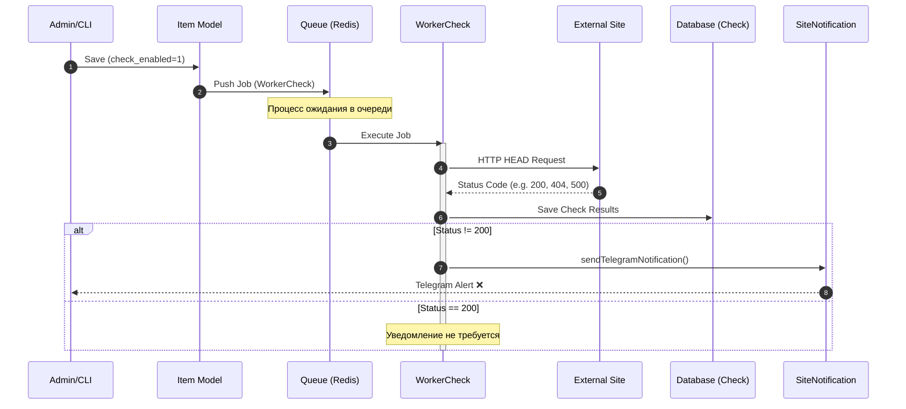

# Механизм проверок доступности сайтов

Система мониторинга предназначена для регулярной проверки доступности сайтов (объектов `Item`) и уведомления администраторов в случае возникновения проблем.

## Обзор архитектуры

Процесс мониторинга построен на базе очередей Yii2 (`yii2-queue`) и состоит из следующих уровней:
1. **Инициация (Trigger)**: Момент, когда проверка ставится в очередь.
2. **Исполнение (Worker)**: Фоновый процесс, выполняющий HTTP-запрос.
3. **Хранение (Storage)**: Сохранение результатов в базу данных.
4. **Уведомление (Notification)**: Оповещение через Telegram/Email при сбое.
5. **Визуализация (UI)**: Отображение статусов в панели управления.

### Схема процесса (Sequence Diagram)




---

## Основные компоненты

### 1. WorkerCheck (`common\components\check\WorkerCheck`)
Класс задания для очереди, реализующий `JobInterface`. Это "сердце" системы.
- **Действие**: Выполняет метод `HEAD` к сайту.
- **Эндпоинты**: Пытается обратиться к `/wp-json/custom/v1/status` (для WordPress) перед тем, как считать сайт недоступным.
- **Таймаут**: 30 секунд.
- **Результат**: Фиксирует HTTP-код ответа, время отклика (`response_time`) и сообщение об ошибке.

### 2. Check Controller (`frontend\controllers\CheckController`)
Предоставляет интерфейс для просмотра истории и текущего состояния:
- `actionIndex`: Список всех проверок.
- `actionSite(id)`: История проверок для конкретного сайта.
- `actionDashboard`: Общая панель с текущими статусами всех активных сайтов.

### 3. Модели
- `common\models\Check`: AR-модель для таблицы `check`. Хранит лог каждой проверки.
- `common\models\Item`: Представляет сайт. Содержит флаг `check_enabled` и связь `lastCheck` для получения актуального статуса.

---

## Процесс работы

### Как запускаются проверки

1. **Автоматически при сохранении**:
   В методе `Item::afterSave()`, если у сайта включен мониторинг (`check_enabled`), новая задача `WorkerCheck` немедленно помещается в очередь.

2. **Консольные команды (Cron)**:
   Класс `console\controllers\QueueController` содержит команды для массового управления:
   - `php yii queue/setup-daily-monitoring`: Ставит в очередь проверку всех активных сайтов. Обычно запускается по крону раз в сутки (в 6:00 утра).
   - `php yii queue/run-immediate-checks`: Немедленный запуск проверки всех сайтов.

### Выполнение в очереди

Когда воркер очереди подхватывает задачу `WorkerCheck`:
1. Измеряется время начала.
2. Выполняется `HEAD` запрос через `get_headers`.
3. Создается запись в таблице `check`.
4. **Если статус не 200**: Инициируется отправка уведомления через `SiteNotification`.

---

## Уведомления

За отправку отвечает компонент `common\components\SiteNotification`.
- **Telegram**: Отправляет сообщение с деталями ошибки (URL, статус, время, текст ошибки) в чат, указанный в параметрах `telegram_chat_id`.
- **Email**: (Опционально) Отправляет HTML-письмо администратору.

---

## Полезные команды для разработчика

```bash
# Проверить статус очереди
php yii queue/info

# Очистить очередь
php yii queue/clear

# Запустить воркер для обработки задач
php yii queue/listen

# Проверить текущий статус всех сайтов в консоли
php yii queue/monitoring-status
```
