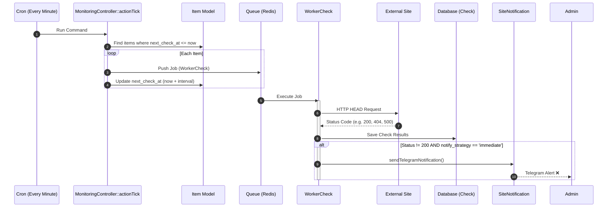

# Механизм проверок доступности сайтов

Система мониторинга предназначена для регулярной проверки доступности сайтов (объектов `Item`) с настраиваемой частотой и гибкими стратегиями уведомлений.

## Обзор архитектуры

Процесс мониторинга построен на базе очередей Yii2 (`yii2-queue`) и состоит из следующих уровней:
1. **Планирование (Tick)**: Ежеминутный процесс, который находит сайты, требующие проверки.
2. **Исполнение (Worker)**: Фоновый процесс, выполняющий HTTP-запрос.
3. **Хранение (Storage)**: Сохранение результатов в базу данных (`Check`).
4. **Уведомление (Notification)**: Оповещение через Telegram в зависимости от стратегии (мгновенно или сводный отчет).
5. **Визуализация (UI)**: Отображение статусов и истории в панели управления.

### Схема процесса (Sequence Diagram)



---

## Основные компоненты

### 1. Monitoring Controller (`console\controllers\MonitoringController`)
Новый "мозг" системы:
- `actionTick`: Основной планировщик. Проверяет время `next_check_at` в БД.
- `actionDailyReport`: Формирует и отправляет сводный отчет по сайтам со стратегией `summary`.

### 2. WorkerCheck (`common\components\check\WorkerCheck`)
Задание для очереди:
- **Действие**: Выполняет метод `HEAD` к сайту.
- **Логика**: Пытается обратиться к нескольким эндпоинтам (для WP), если основной URL не отвечает 200.
- **Уведомления**: Если сайт упал, проверяет `notify_strategy`. Если `immediate`, отправляет алерты в Telegram.

### 3. Модель Item (`common\models\Item`)
- `check_enabled`: Включение мониторинга.
- `check_interval`: Интервал в минутах (5, 15, 60 и т.д.).
- `notify_strategy`: `immediate` (алерты сразу), `summary` (в ежедневном отчете), `disabled`.
- `next_check_at`: Точное время следующей запланированной проверки.
- `afterSave()`: Автоматически сбрасывает `next_check_at` на "сейчас" при изменении любых настроек мониторинга, чтобы изменения вступили в силу мгновенно.

---

## Процесс работы

### Как запускаются проверки

1. **Планировщик (Cron)**:
   Каждую минуту запускается комбинированная команда:
   `php yii monitoring/tick && php yii queue/run`
   Это гарантирует, что задачи сначала планируются, а затем сразу выполняются тем же процессом.

2. **Массовое управление (`QueueController`)**:
   - `php yii queue/enable-all-monitoring`: Включает мониторинг для всех опубликованных сайтов.
   - `php yii queue/run-immediate-checks`: Форсирует проверку всех сайтов прямо сейчас.

---

## Полезные команды для разработчика

```bash
# Основной цикл (настроен в Cron)
php yii monitoring/tick && php yii queue/run

# Ручной запуск планировщика (без выполнения задач)
php yii monitoring/tick

# Выполнить задачи из очереди
php yii queue/run

# Логирование (смотреть в реальном времени)
tail -f runtime/logs/app.log | grep monitoring
```
